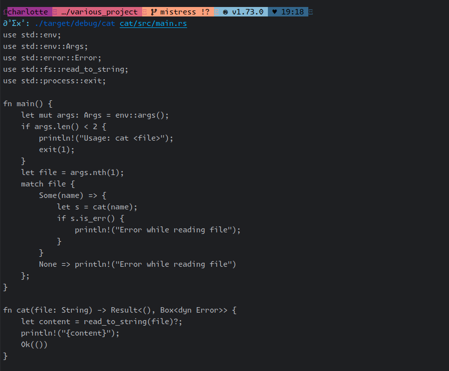
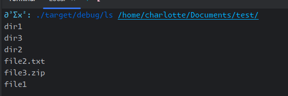
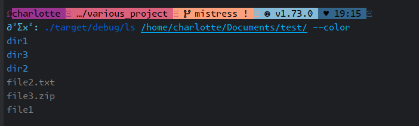
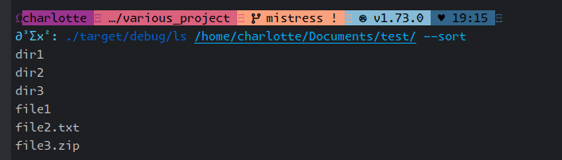
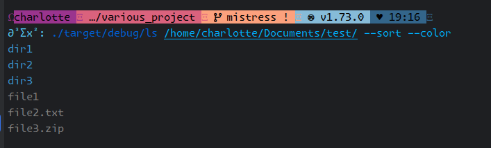

# Various projects

projects done in Rust to learn the language.

TODO List
- [x] cat
- [x] ls
- [ ] tinysh
- [ ] calc

# Building

To build the projects do

```bash
cargo build --release
```

## Cat

The first project is doing a cat command just do

```bash 
./target/release/cat <file>
```

### Usage



## LS

The second project is an implementation of the command ls, you can use it like this

```bash 
./target/release/ls <dir>
```

### Usage

You can just do

```bash 
./target/release/ls <dir>
```

which produces


However this one has _options_

### Options

#### Colour

You can add _colours_ to the output with the `--color` or `-c` option


#### Sort

You can sort alphabetically the output with the `--sort` or `-s` option


#### Both

And you can combine them to have a _beautiful_ **sorted** output

